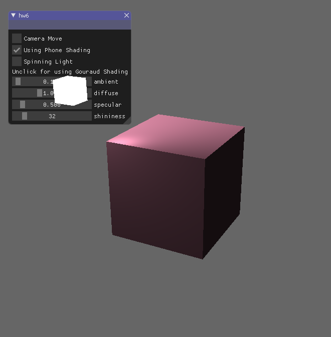
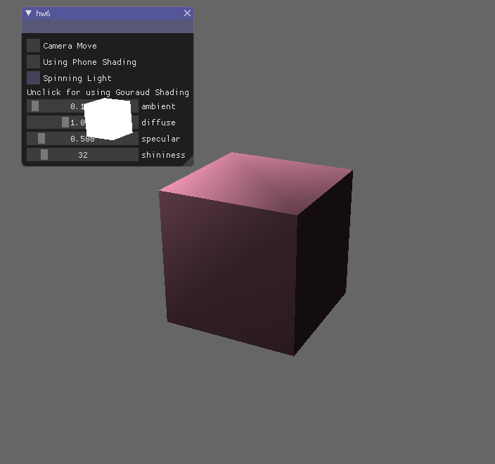
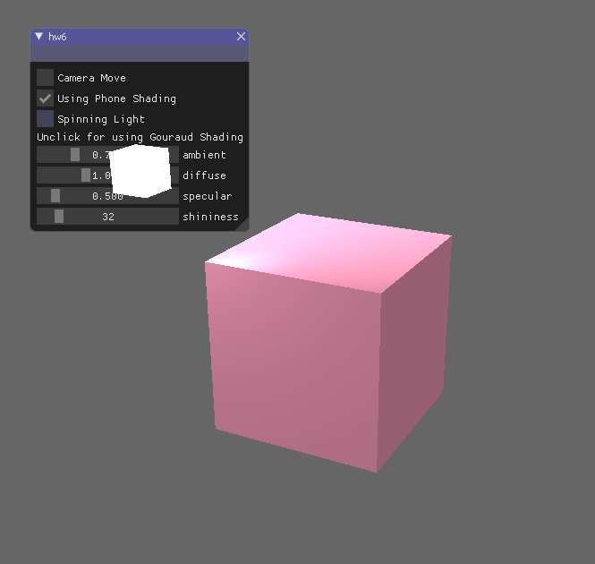
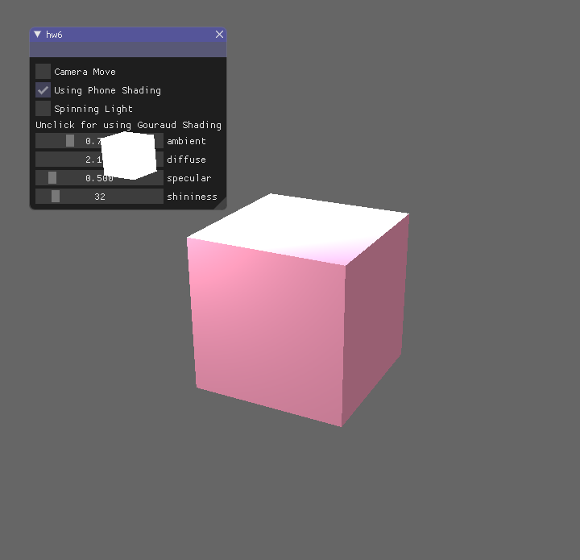
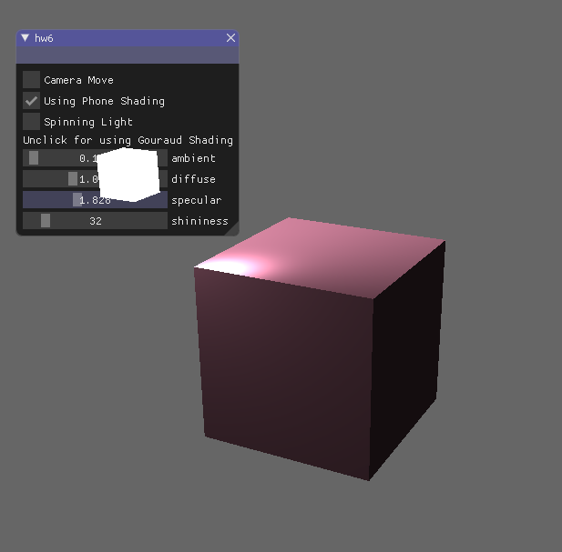
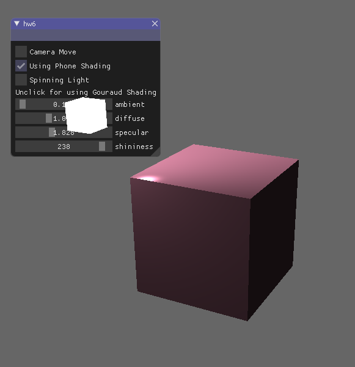
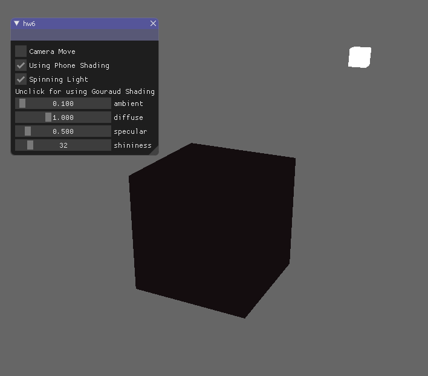
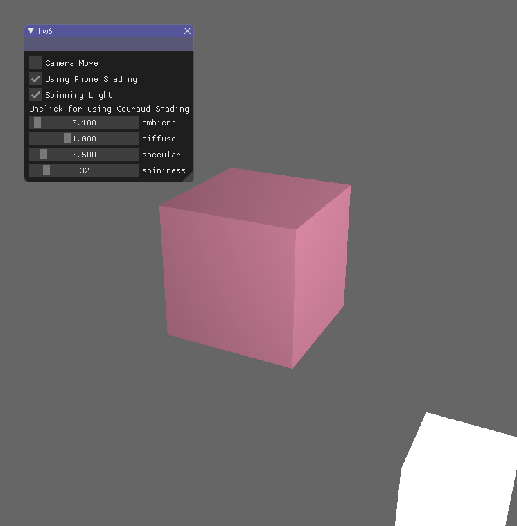

# Homework 6 - Lights and shading 
## 张子轩 16340297

### Basic：
+ 实现Phong局部光照模型，使用GUI：

    - 初始状态：

    

    - 使用Grouaud shadding：

    

    - 调整环境光：

    

    - 调整漫反射强度：

    

    - 调整镜面反射强度：

    

    - 调整反光度：

    

    - 解释shadding实现原理：

        Phong shadding是在片段着色器中实现，对于每一个片段上的像素进行Phong 光照模型计算。

        Grouaud shadding是在顶点着色器中实现，对于每个顶点进行Phong光照模型计算，计算次数较少。

### Bonus：
+ 实现光源移动：
    - 光源移动：

    

    

