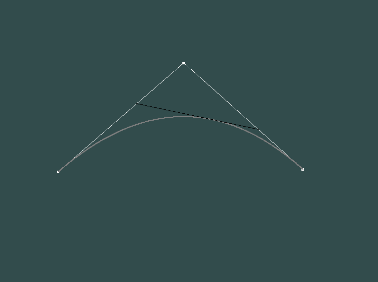
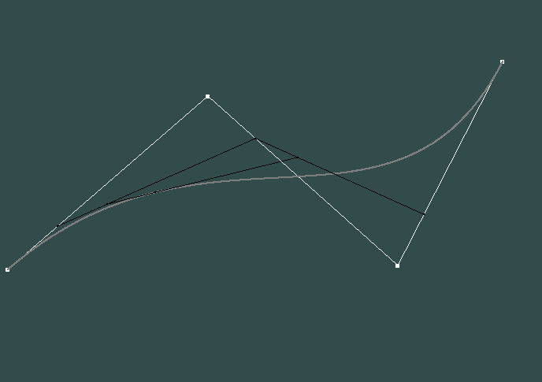
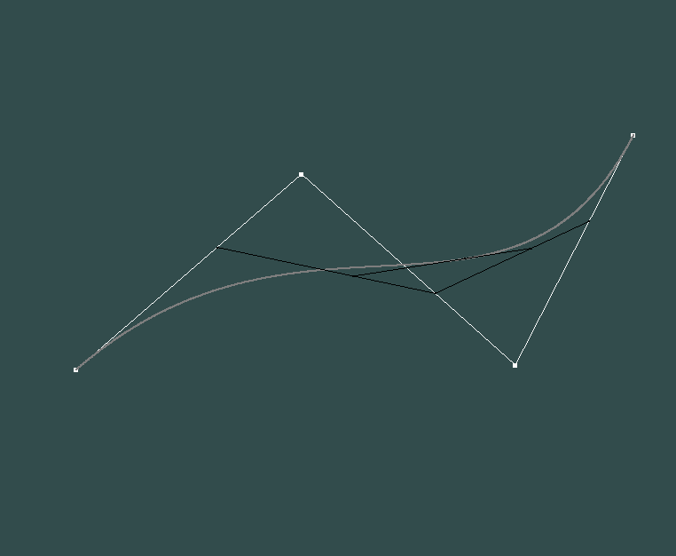

# HW8
## 张子轩 16340297
## 实验要求
### Basic:
1. 用户能通过左键点击添加Bezier曲线的控制点，右键点击则对当前添加的最后一个控制点进行消除
2. 工具根据鼠标绘制的控制点实时更新Bezier曲线。
### Bonus:
1. 可以动态地呈现Bezier曲线的生成过程。

## 实现效果：

+ 三个控制点：

+ 四个控制点：

+ 动态呈现：

## 算法描述

+ 鼠标输入捕获：

        void mouse_move_callback(GLFWwindow * window, double xpos, double ypos) {
            xCur = (xpos - SCR_WIDTH / 2) / SCR_WIDTH * 2;
            yCur = 0 - (ypos - SCR_HEIGHT / 2) / SCR_HEIGHT * 2;
        };

        void mouse_button_callback(GLFWwindow * window, int button, int action, int mods)
        {
            if (button == GLFW_MOUSE_BUTTON_LEFT && action == GLFW_PRESS) {
                Point point;
                point.setxy(xCur, yCur);
                pointSet.push_back(point);
            }

            if (button == GLFW_MOUSE_BUTTON_RIGHT && action == GLFW_PRESS) {
                if (!pointSet.empty())
                    pointSet.pop_back();
            }
        }

+ draw类，包含点、线绘制以及动态效果实现（将pointSet设为私有成员变量绘制结果会出错，改为使用全局变量）：

    - 点和线的实现之前实现过，主要介绍Bezier曲线和动态效果实现。

    - Bezier曲线，查询网上博客，参照Bezier曲线的公式实现，先计算组合数，然后计算
    $$ B_{i,n}(t) $$
    和点的坐标，绘制点：
        
            int size = pointSet.size();
            int n = size - 1;
            float* B = new float[size];
            for (int i = 0; i < size; i++) {
                int k = i, x = 1;
                float c = 1.0;
                if (k > n - k)
                    k = n - k;
                for (int j = n; j > n - k; j--, x++)
                    c *= (float)j / x;
                B[i] = c;
            }

            for (float t = 0.0; t < 1.0; t += delta) {
                float x = 0.0, y = 0.0, tmp;
                for (int i = 0; i <= n; i++) {
                    tmp = B[i] * pow(t, i) * pow(1 - t, n - i);
                    x += tmp * pointSet[i].x;
                    y += tmp * pointSet[i].y;
                }
                drawPoint(shaderProgram, x, y, 2.0f, color);
            }

## Bonus
+ 动态效果呈现：

        vector<Point> new_points;
		float x1, y1, x2, y2;
		Point point;

		while (points.size() >= 2) {
			new_points.clear();
			x2 = points[0].x + t * (points[1].x - points[0].x);
			y2 = points[0].y + t * (points[1].y - points[0].y);
			point.setxy(x2, y2);
			new_points.push_back(point);
			drawPoint(shaderProgram, x2, y2, 2.0f, color);

			for (int i = 2; i <= points.size() - 1; i++) {
				x1 = x2;
				y1 = y2;
				x2 = points[i - 1].x + t * (points[i].x - points[i - 1].x);
				y2 = points[i - 1].y + t * (points[i].y - points[i - 1].y);
				point.setxy(x2, y2);
				new_points.push_back(point);
				drawPoint(shaderProgram, x2, y2, 2.0f, color);
				drawLine(shaderProgram, x1, y1, x2, y2, color);
			}
			points.assign(new_points.begin(), new_points.end());
		}
		return;
